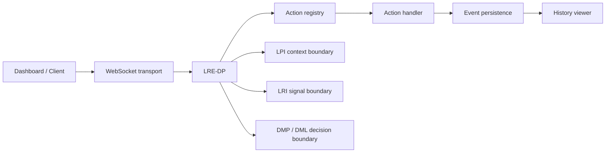

# Grant Evidence Package

Status: reviewer-facing evidence package.

Scope: this document summarizes the current LRE-Core artifact, reproducible reviewer path, evidence assets, explicit non-claims, and near-term roadmap for grant reviewers and technical evaluators.

## One-sentence claim

LRE-Core is an experimental runtime integration sandbox for the Liminal ecosystem: it demonstrates how decision execution, presence semantics, relational identity signals, protocol transport, event history, and dashboard inspection can be wired into a small runnable environment.

## Core idea

LRE-Core is not the formal protocol layer itself.

It is the integration bench that helps answer:

```text
Can the Liminal protocols be wired together into a running runtime loop?
```

Current flow:

```text
message / event -> WebSocket transport -> LRE-DP -> action registry -> event history -> dashboard inspection
```

With intended protocol relationships:

```text
LPI provides interaction context.
LRI contributes identity / relational governance signals.
DMP / DML contributes decision logic.
LTP contributes transport/event framing.
LRE-DP executes registered actions.
```

## Why this matters

Protocol artifacts are easier to evaluate when reviewers can see integration behavior, even in a small sandbox.

LRE-Core provides a concrete place to exercise:

- runtime decision dispatch,
- WebSocket transport,
- event registry semantics,
- persistence/history inspection,
- dashboard visibility,
- lightweight integration boundaries between Liminal protocols.

This makes it useful as a demonstration and integration surface for the broader Liminal Evidence Stack.

## Reviewer path

Install dependencies:

```bash
pip install -r requirements.txt
```

Run the local server:

```bash
python src/examples/server_demo.py
```

Open dashboard:

```text
https://safal207.github.io/LRE-Core/
```

Or locally:

```bash
open tools/dashboard.html
```

Run tests if available in the local checkout:

```bash
python -m unittest discover -s tests -q
```

Review key artifacts:

```text
README.md
docs/EVENT_REGISTRY.md
docs/DASHBOARD_HISTORY_VIEWER.md
src/lre_dp.py
src/core/events.py
src/execution/registry.py
src/execution/stdlib.py
src/transport/
src/storage/
src/examples/server_demo.py
tools/dashboard.html
tests/
```

## Architecture at a glance



The important boundary:

```text
LRE-Core integrates and demonstrates protocol interactions.
LRE-Core is not the canonical definition of every protocol it touches.
```

## Current evidence matrix

| Evidence asset | Reviewer question | Path / command | Current status |
| --- | --- | --- | --- |
| README | Is there a runnable entry point? | `README.md` | Documented |
| Server demo | Can a local runtime start? | `python src/examples/server_demo.py` | Implemented |
| Dashboard | Can runtime events be inspected visually? | `tools/dashboard.html` / GitHub Pages | Implemented |
| LRE-DP | Is there a decision execution surface? | `src/lre_dp.py` | Implemented |
| Action registry | Are runtime actions registered and dispatched? | `src/execution/registry.py` | Implemented |
| Standard actions | Are example handlers present? | `src/execution/stdlib.py` | Implemented |
| Event constants | Are canonical runtime events listed in code? | `src/core/events.py` | Implemented |
| Event registry doc | Are runtime events documented? | `docs/EVENT_REGISTRY.md` | Documented |
| History viewer doc | Is dashboard history inspection documented? | `docs/DASHBOARD_HISTORY_VIEWER.md` | Documented |
| Persistence/history | Is event history represented? | `src/storage/` | Implemented |
| Tests | Are integration behaviors testable? | `python -m unittest discover -s tests -q` | Implemented / evolving |

## What is already implemented

- WebSocket server demo.
- Hosted dashboard that can connect to local backend.
- LRE-DP execution surface.
- Action registry.
- Basic runtime actions such as ping/echo/history retrieval.
- Event constants and event registry docs.
- SQLite-backed event history / persistence layer.
- History viewer with filtering by trace, agent, type, and limit.
- Dashboard inspection surface.
- Compatibility tests for LRE-DP initialization.
- Integration tests for action dispatch and history retrieval.

## Core design principles

LRE-Core is organized around integration-sandbox principles:

```text
Keep protocols separable.
Make runtime behavior visible.
Prefer small runnable demos over abstract integration claims.
Record event history for inspection.
Keep canonical protocol semantics outside the sandbox when appropriate.
Use LRE-Core to test wiring, not to overclaim production readiness.
```

## What LRE-Core makes inspectable

LRE-Core is designed to make integration behavior inspectable, including:

- incoming and outgoing runtime events,
- trace/session identifiers,
- agent identifiers where present,
- action dispatch paths,
- history retrieval behavior,
- dashboard-visible event streams,
- basic runtime latency/connection behavior,
- protocol-boundary assumptions between LPI, LRI, DMP/DML, LTP, and LRE-DP.

## Relationship to the Liminal Evidence Stack

LRE-Core is the integration sandbox / demo runtime.

- **LRE-Core:** demonstrates how Liminal protocol components can be wired into a small runtime loop.
- **LPI:** provides semantic interaction context and consent/trust/session metadata.
- **LRI:** provides living identity governance signals and boundaries.
- **DMP / DML:** provides decision/consequence or decision-logic surfaces.
- **LTP:** provides transport/event framing in this runtime context.
- **DRP:** records structured decisions outside the sandbox.
- **T-Trace:** defines machine-checkable trace records outside the sandbox.
- **CML/vCML:** audits causal validity and authorization lineage outside the sandbox.
- **CaPU:** controls side-effect lifecycle in the broader stack.
- **PythiaLabs:** gates high-risk actions before execution in the broader stack.
- **TTM DB / LiminalDB:** preserve trace/evidence substrates and derived views.

Short version:

```text
LRE-Core is the lab bench.
The Liminal Evidence Stack is the formal reviewer path.
```

## What this project does not claim yet

LRE-Core currently does not claim:

- to be a production multi-agent operating system,
- to be a certified safety enforcement layer,
- to define the canonical semantics of LPI, LRI, DMP, LTP, DRP, CML, or CaPU,
- to replace protocol-specific validators,
- to replace security, IAM, observability, or compliance tooling,
- to guarantee safe agent behavior by itself,
- to provide production-grade persistence guarantees,
- to provide a stable public runtime API,
- to be the final architecture for Liminal systems.

The narrower claim is stronger:

```text
LRE-Core is a runnable integration sandbox for demonstrating protocol wiring, runtime event dispatch, persistence/history inspection, and dashboard-visible behavior across Liminal components.
```

## Why this is grant-relevant

Grant reviewers often need both formal artifacts and runnable integration surfaces.

LRE-Core contributes a practical demonstration layer:

```text
protocol concepts -> runnable runtime loop -> inspectable event history -> dashboard-visible evidence
```

This supports demonstrations, integration testing, reviewer walkthroughs, and future trace/evidence experiments.

## Research / build roadmap

Near-term work can focus on:

1. **Validation snapshot** — add a tracked root-level validation result if not already present.
2. **Scope hardening** — keep integration-sandbox boundaries explicit.
3. **Protocol boundary docs** — clarify what LRE-Core owns vs LPI/LRI/DMP/LTP/DRP/T-Trace/CML/CaPU.
4. **T-Trace bridge** — map runtime events to canonical trace records.
5. **CML bridge** — add examples where runtime actions require causal authorization lineage.
6. **CaPU bridge** — show how high-risk actions can be held until commit-before-effect conditions pass.
7. **PythiaLabs bridge** — add pre-action gate examples before runtime dispatch.
8. **Dashboard evidence report** — export filtered history as a reviewer-facing report.
9. **Runtime conformance tests** — expand tests for event registry, history, dispatch, and invalid actions.
10. **Demo script** — add a single command that starts server, emits events, and prints inspection results.

## Suggested reviewer checklist

A reviewer can ask:

- Can I run the local server?
- Can I open the dashboard?
- Can I see events flowing through the runtime?
- Can I inspect event history?
- Are protocol boundaries explicit?
- Are non-claims clear?
- Is LRE-Core positioned as a sandbox rather than a production safety runtime?
- Is there a path to connect runtime events to T-Trace/CML/CaPU/PythiaLabs evidence?

## Current strongest positioning

Use this formulation in applications:

```text
LRE-Core is an experimental integration sandbox for Liminal protocols. It demonstrates runtime event flow, decision dispatch, WebSocket transport, persistence/history inspection, and dashboard-visible behavior without claiming to be the production safety layer or the canonical source of protocol semantics.
```

## Short version

```text
LRE-Core is the lab bench.
The evidence stack is the formal reviewer path.
```
