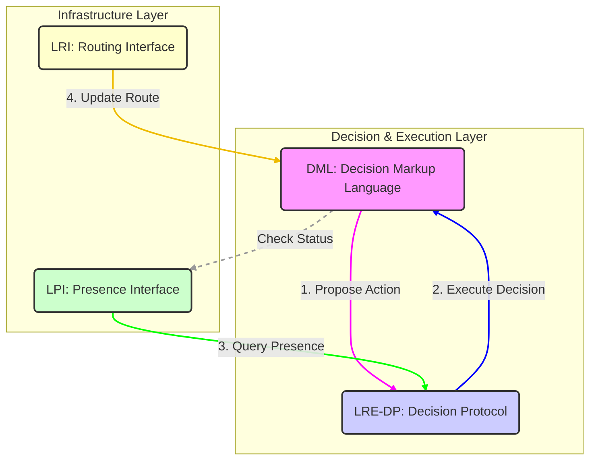

# LRE-Core Architecture

## System Diagram (v2)

This diagram illustrates the interaction between the Decision Markup Language (DML), Liminal Runtime Environment (LRE-DP), Presence (LPI), and Routing (LRI) components.

