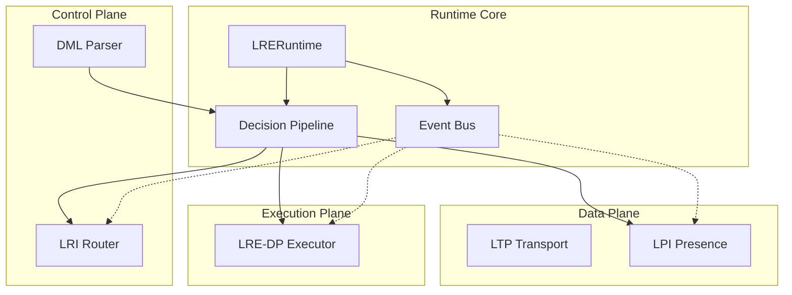

# Core Runtime Architecture

The LRE-Core Runtime architecture is designed around three planes: Control, Data, and Execution. The `LRERuntime` class acts as the central orchestrator, binding these planes together through an asynchronous Event Bus and a structured Decision Pipeline.

## Architecture Diagram



## LTP: Liminal Transport Protocol

**Status:** ✅ Implemented (PR #6)

### Overview
LTP provides WebSocket-based communication between external clients and the LRE-Core runtime.

### Protocol Specification

**Endpoint:** `ws://localhost:8000`

**Inbound Message (Command):**
```json
{
  "action": "system_ping",
  "agent_id": "agent_001",
  "payload": {
    // Action-specific data
  }
}
```

**Outbound Message (Result):**
```json
{
  "type": "execution_result",
  "data": {
    "status": "executed",
    "trace_id": "uuid-here",
    "result": {
      # Action result
    },
    "latency_ms": 123.45
  }
}
```

**Error Response:**
```json
{
  "type": "error",
  "message": "Error description"
}
```

### Current Limitations (v1)
- Single client at a time
- No authentication
- No event streaming (future)
- No reconnection logic

### Future Enhancements (Declared but Dormant)
- Multi-client broadcast
- Event streaming (decision.*, presence.*)
- Authentication & authorization
- Rate limiting
- Circuit breaker for external calls

## Components

### 1. Runtime Orchestrator (`LRERuntime`)
The entry point of the system. It is responsible for:
- Initializing the environment and submodules.
- Dependency injection for protocols (LPI, LRI, DML, LRE-DP).
- Managing the lifecycle of the application (startup, loop, shutdown).
- Handling top-level error boundaries.

### 2. Decision Pipeline (`DecisionPipeline`)
The critical path for decision processing. It executes a 6-step flow:
1.  **Parse**: Validates the input `dml_input`.
2.  **Context**: Wraps the execution in a `DecisionContext` for tracing and timing.
3.  **Presence Check (LPI)**: Verifies if the target agent is online via LPI. If offline, the decision is deferred.
4.  **Routing (LRI)**: Calculates the route for the action via LRI.
5.  **Execute (LRE-DP)**: Delegates the actual execution to the LRE-DP component.
6.  **Result Handling**: Aggregates the result, latency, and errors into a standardized response.

### 3. Async Event Bus (`EventBus`)
A lightweight, in-memory pub/sub system enabling decoupled communication between components.
Supported topics include:
- `decision.received`
- `decision.validated`
- `decision.executing`
- `decision.completed`
- `decision.failed`
- `presence.changed`
- `route.updated`

Wildcard subscriptions (e.g., `decision.*`) are supported.

## Integration Patterns

The runtime uses dependency injection to integrate the protocols. Submodules (`src/lpi`, `src/lri`, etc.) are dynamically added to `sys.path` to ensure importability.

- **LPI (Presence)**: Used to query agent status.
- **LRI (Routing)**: Used to determine decision routing.
- **LRE-DP (Execution)**: Used to execute the business logic of the decision.
- **DML (Logic)**: (Future) Used to parse and validate decision markup.

## API Reference

### `LRERuntime`
- `initialize()`: Async setup.
- `process_decision(dml_input: dict) -> dict`: Process a single decision.
- `shutdown()`: Graceful cleanup.

### `DecisionContext`
- `get_trace_id()`: Returns the unique trace ID.
- `add_metadata(key, value)`: Adds debug info.
- `get_summary()`: Returns the execution summary.

### `EventBus`
- `publish(topic, data)`: Emit an event.
- `subscribe(topic, handler)`: Listen for events.
